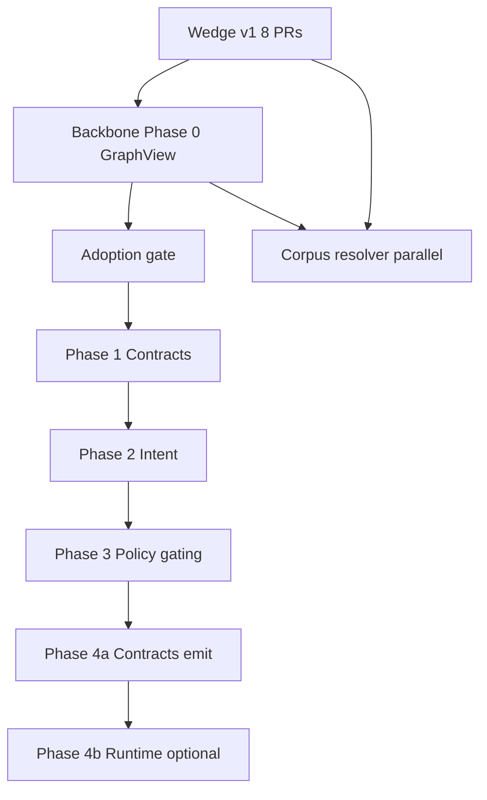

# Backbone v2 Roadmap

> **This is NOT the active execution plan.**  
> **Active scope:** Wedge v1 + Phase 0 consolidation (see CHANGELOG 0.5.1).  
> **Gated work:** [`future-roadmap-gated.md`](future-roadmap-gated.md) — starts only after [`adoption-gate.md`](adoption-gate.md) passes.

**Status:** Working roadmap only — not an active execution plan until Wedge v1 ships. Promote unchanged to [backbone-v2-roadmap.md](backbone-v2-roadmap.md) in the repo when Wedge v1 is green. Do not edit this roadmap again unless implementation exposes a real contradiction.

---

## Strategy (read this first)

The [architecture doc](https://github.com/ClearMetric-Labs/ClearMetric-Core/blob/main/clearmetric-architecture.md) describes the **full foundation**. The **build strategy** is unchanged:

1. **Ship the wedge first** — column-level lineage and impact, local, one command, zero authored intent.
2. **Let the foundation accrete** — metrics, queries, policy-gated exports, runtime — when adoption pulls it.

This roadmap is **Backbone v2**. It does **not** replace finishing Wedge v1. Phases 1–6 here are the **next product layer** (platform-shaped). Executing them on momentum — before real users confirm the wedge — is the trap this document is designed to prevent.

| Track | What | When |
|-------|------|------|
| **Wedge v1** | Metadata + lineage + impact + catalog + cleaner | **Now** — finish 8-PR consolidation |
| **Backbone Phase 0** | GraphView consolidation | **Immediately after** Wedge v1 green |
| **Backbone Phases 1–6** | Contracts, intent, policy rewrite, runtime | **Gated** on adoption pull |
| **Corpus / resolver** | Is lineage *correct* on messy SQL? | **Ongoing parallel** — not solved by GraphView |

---

## Wedge v1 completion checklist (do this first)

Do not start Backbone until all are true (much may already be done per CHANGELOG 0.3/0.4):

```text
1. Remove Snowflake stub — INFORMATION_SCHEMA JSON only
2. Policy at config load + optional aliases
3. attach_warehouse_bindings
4. Merge semantics (schema_drift / source_disagreement warnings)
5. Cleaner posture registry
6. build_graph / check_graph / enforce_graph split
7. CLI unification (project-first clearmetric.yaml)
8. Catalog projection (compile --format catalog) + lineage-demo + docs/v1-boundary
```

**Proof command (Wedge v1):**

```bash
cm init
cm connect warehouse --information-schema ./warehouse_schema.json
cm scan
cm compile --format json > graph.json
cm compile --format catalog > catalog.json
cm impact orders.amount --upstream
cm clean
cm contract graph.json
```

No `--identity`. No metrics. No runtime. That is the shipped promise.

---

## Adoption gate (before Phases 1–6) — hardest gate, do not fudge

Pass **all** of:

- [ ] Wedge v1 checklist green in CI
- [ ] Wedge used by at least one **real user who is not the implementer** (internal teammate counts if they actually ran it on their project)
- [ ] **External pull on record** in `docs/adoption-gate.md` with:
  - **Named asker** — person, team, or paying org (not "we decided")
  - **Verbatim quote** — what they asked for (metrics? gated export? runtime?)
  - **Link** — GitHub issue, email thread, or customer ticket

**Fails the gate:** "the plan looks good," "internal decision," "we'll need this eventually," momentum, or a quote you wrote for them.

This gate exists because *you* make internal decisions at 2am. It must be external evidence.

If the gate fails: **stop at Phase 0** (GraphView). Phase 0 makes the wedge cleaner; it does not expand product scope.

---

## What this roadmap gets right (keep)

- **One GraphView** — single traversal surface; delete `lineage/graph.py` and `trace_*_from_project`
- **One policy facade** — `evaluate_node`, `gate`, `validate_security_floor`; floor logic only in `policy.floor`
- **One projection path** — `project_for_emit` for gated formats; admin `catalog` stays a stable unfiltered lens; delete `project_graph` only
- **Delete, don't reroute** — no deprecated wrappers or compatibility shims
- **Typed loud errors** — error matrix with specific exception types
- **Live warehouse execution out of scope** — DuckDB fixtures only in Phase 4b, if ever

---

## Critical corrections from review (v4)

### 1. Do not require `--identity` on `cm impact`

**Wrong (v3):** impact always policy-gated — can return dangerously incomplete answers ("nothing breaks" when a hidden downstream exists).

**Right:**

```bash
cm impact orders.amount --upstream          # default: full enforced graph, lineage truth (dev wedge)
cm impact orders.amount --upstream --identity analyst   # optional: governance preview only
```

Impact is a **developer tool** for "what breaks if I change this column." Identity-gating is opt-in, documented as incomplete for permission analysis.

### 2. Compile format rules (fix contradiction)

| Format | Identity | Purpose |
|--------|----------|---------|
| `json` | **Not required** | Full graph artifact — debug / CI / `cm contract` |
| `text` | **Not required** | Human debug summary |
| `catalog` | **Not required** | **Admin asset slice** (table/column/model) — wedge contract, **unchanged forever** |
| `consumer-catalog`, `openlineage`, `frontend-contract`, `ai-context` | **Required** | Policy-gated consumer projections (Phase 3+) |

Phase 3 is **additive**: wedge users keep `cm compile --format catalog` with no identity. Gated catalog is a **new format** `consumer-catalog`, not a semantic change to `catalog`.

### 3. Split Phase 4: contracts before runtime

| Sub-phase | Delivers | Value |
|-----------|----------|-------|
| **4a** | `compile_contracts`, `compiled_sql` on graph, `frontend-contract` emitter | Bindable contracts — consumer runs SQL themselves |
| **4b** | DuckDB executor, `cm query`, `cm serve`, HTTP server | Highest maintenance — **separate bet**, defer until 4a shipped + adoption gate |

The contract JSON is the differentiator; the executor is optional infrastructure.

### 4. Intent adapter: batch errors

One invalid file must still fail ingest — but collect **all** validation errors across all files, then raise one `AdapterError` listing every `path: reason`. No fail-on-first across 200 files.

### 5. Policy rewrite: adversarial tests (Phase 3)

`evaluate_node` is security-critical. Required suite `tests/policy/test_adversarial.py`:

- Deny rule always beats allow on same node
- Evaluator exception → deny (fail closed)
- Masking decision does not expose unmasked fields via alternate emit format
- RLS filter excludes rows/nodes from gated projection
- Wrong identity → deny
- Empty rules → deny (deny-by-default)
- Security floor violations cannot be posture-disabled

Happy-path unit tests alone are insufficient for Phase 3 sign-off.

### 6. Resolver correctness is not in this roadmap

`ground_truth.py` parity (Phase 0) proves **no regression** during GraphView refactor — not that lineage was correct on messy SQL.

**Parallel track (always):** hand-authored honesty corpus, adversarial SQL fixtures, [`reference/lineage-limitations.md`](reference/lineage-limitations.md). Do not let backbone engineering substitute for corpus work.

---

## Phase 0 — GraphView consolidation (after Wedge v1, before adoption gate)

**Scope:** Pure refactor. No metric nodes, no policy rewrite, no runtime.

**Risk:** Low — parity gate prevents regression.

### Deliverables

```
clearmetric/graph/
  view.py       # GraphView, view_of
  traverse.py   # walk_related, neighbors, build_traversal_subgraph
  impact.py     # trace_*_from_artifact
  render.py     # impact text/mermaid renderers
  subjects.py   # column/dataset helpers for impact + OpenLineage
  selector.py   # selector grammar (Phase 5 breadth; registry exists)
  __init__.py
```

**Selector:** `graph/selector.py` supports CheckSpec scoping only; full graph query API is Phase 5.

### Delete

- [lineage/graph.py](https://github.com/ClearMetric-Labs/ClearMetric-Core/blob/main/packages/clearmetric-core/src/clearmetric/lineage/graph.py) — entire file
- `trace_upstream_from_project`, `trace_downstream_from_project` — functions + exports

### Keep

- `load_project`, `build_catalog_artifact_from_project` — adapter ingest, not traversal
- Wedge CLI behavior unchanged including **unfiltered impact**

### Pipeline stub

[compiler/pipeline.py](https://github.com/ClearMetric-Labs/ClearMetric-Core/blob/main/packages/clearmetric-core/src/clearmetric/compiler/pipeline.py) documents **current wedge stages only**:

```python
PIPELINE_STAGES = ("discover", "ingest", "merge", "bind")
```

Extend with `link`, `compile_contracts` when Phases 2 and 4a start — not before.

### Exit criteria (complete in 0.5.1)

- Zero adjacency logic outside `clearmetric.graph`
- `ground_truth.py` — identical `related_ids` pre/post
- Wedge e2e green
- No new CLI flags

---

## Phase 1 — Contract primitive (gated)

**Gate:** Adoption gate passed.

Add `metric` / `query` node kinds, [core/contracts.py](https://github.com/ClearMetric-Labs/ClearMetric-Core/blob/main/packages/clearmetric-core/src/clearmetric/core/contracts.py), ID helpers, [compiler/contracts.py](https://github.com/ClearMetric-Labs/ClearMetric-Core/blob/main/packages/clearmetric-core/src/clearmetric/compiler/contracts.py) validation.

No adapter yet — hand-built fixtures in tests.

---

## Phase 2 — Intent adapter (gated)

**Gate:** Adoption gate + Phase 1.

[adapters/intent.py](https://github.com/ClearMetric-Labs/ClearMetric-Core/blob/main/packages/clearmetric-core/src/clearmetric/adapters/intent.py), packaged [`intent.schema.json`](https://github.com/ClearMetric-Labs/ClearMetric-Core/blob/main/packages/clearmetric-core/src/clearmetric/spec/intent.schema.json), `compiler/link_metrics.py` (add at gate).

**Batch validation:** scan all YAML → collect errors → single `AdapterError` with full list.

---

## Phase 3 — Policy + consumer projection gating (gated)

**Gate:** Adoption gate + Phase 1 (can overlap Phase 2 tail).

- Rewrite [policy/evaluate.py](https://github.com/ClearMetric-Labs/ClearMetric-Core/blob/main/packages/clearmetric-core/src/clearmetric/policy/evaluate.py) → `evaluate_node`
- Re-add `policy/gate.py` thin wrapper (removed from wedge tree)
- **Delete** `project_graph` (ungated generic projection)
- **Keep** unfiltered admin catalog: `compile --format catalog` — no identity, same wedge semantics
- **Add** `compile --format consumer-catalog --identity ID` — policy-gated via `project_for_emit`
- `--identity` required for `consumer-catalog`, `openlineage`, `frontend-contract`, `ai-context`
- **`cm impact` unfiltered by default**; optional `--identity`
- **Adversarial policy test suite** — sign-off requirement

**Catalog migration (non-breaking):**

```text
Before Phase 3 (Wedge v1 — unchanged after Phase 3):
  cm compile --format catalog
  → admin asset slice (table/column/model), no identity

After Phase 3 (additive):
  cm compile --format consumer-catalog --identity analyst
  → policy-gated consumer catalog projection
```

Document both in CHANGELOG when Phase 3 ships. Early adopters' catalog workflows must not break.

---

## Phase 4a — Contracts on graph + frontend emitter (gated)

**Gate:** Adoption gate + Phase 2.

- Re-add `compiler/compile_contracts.py` and `emitters/frontend_contract.py` (removed from wedge tree)
- `compiled_sql` on query nodes; `CompilerError` on failure

**No** DuckDB, **no** `cm query`, **no** HTTP server.

---

## Phase 4b — Runtime (gated, separate bet)

**Gate:** Phase 4a shipped + explicit runtime pull.

- Re-add `clearmetric.runtime` package, DuckDB `[runtime]` extra, `cm query`, `cm serve`
- Widest maintenance surface — defer until contracts prove value

---

## Phase 5 — Cleaner breadth (gated)

CheckSpec registry, full selector, hygiene checks, declarative user checks.

---

## Phase 6 — Sweep + deferred edges (gated)

Export audit, repo doc, boundary tests, optional live warehouse adapter / policy advisory emitter.

---

## Sequencing diagram



---

## Single public surfaces (unchanged target end-state)

| Module | Public API |
|--------|------------|
| `clearmetric.graph` | `GraphView`, traverse helpers |
| `clearmetric.policy` | `evaluate_node`, `gate`, `validate_security_floor`, `load_rules` |
| `clearmetric.projection` | `project_for_emit`, lens functions |
| `clearmetric.compiler` | `build_graph`, `compile`, `check_graph`, `enforce_graph`, `clean`, `impact` |
| `clearmetric.emitters` | `emit_compile`, `emit_impact`, `EmitContext` |
| `clearmetric.runtime` | `execute_query`, `serve` (Phase 4b only) |

---

## Error matrix (Backbone phases)

| Condition | Error |
|-----------|-------|
| Missing graph node | `GraphError` |
| Unresolved depends_on | `CompilerError` |
| Query SQL compile failure | `CompilerError` |
| Intent validation (any file) | `AdapterError` with **all** paths listed |
| Consumer emit without identity (`consumer-catalog`, etc.) | CLI exit 1 |
| `catalog` format without identity | Allowed (admin slice) |
| Security floor breach | `SecurityFloorError` |
| Policy eval exception | deny (fail closed) |

Derived lineage `partial|failed` — still allowed on sqlglot facts (wedge honesty).

---

## Immediate next action

```text
Now:     Finish Wedge v1 (next PR: remove Snowflake stub if still present).
Then:    Backbone Phase 0 only (GraphView, parity-gated).
Then:    Stop. Evaluate adoption gate with external evidence.
Never:   Phases 1–6 on momentum.
Parallel: Fund the corpus — resolver correctness is the product, not GraphView.
```

**Sign-off:** Finish the wedge. Ship Phase 0. Hold the gate. Fund the corpus.

---

## Explicit non-goals (unchanged)

- Building Phases 1–6 before wedge adoption
- Requiring identity on impact (default)
- Native warehouse RLS deployment
- Catalog UI, clearmetric-cloud, AI agent product
- Substituting backbone structure for resolver correctness work
